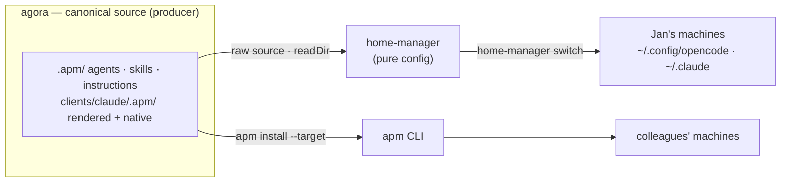

# agora

Canonical source for the personal "AI OS" — agents, skills, and instructions
for OpenCode and Claude Code, packaged as [apm](https://github.com/microsoft/apm)
(Agent Package Manager) packages.

`agora` is the **producer**, and it has two independent consumers:

- **Jan's own machines** are configured by `home-manager`, which reads this
  repo's raw source tree (`inputs.agora`) directly via `readDir` — no build,
  no package, no apm in the middle.
- **Colleagues** install agora's content with `apm install`, which deploys
  the same canonical source into their OpenCode / Claude Code config
  directories.

Both consumers read from the same `.apm/` primitives — there is exactly one
source of truth, never two trees to keep in sync.



## Layout

```
apm.yml                      package: aios-agents-opencode (targets: [opencode])
.apm/
  agents/*.agent.md          11 agents (4 primary + 3 specialist subagents + 4 dev subagents)
  skills/*/SKILL.md          16 skills (15 shared + context-audit)
  instructions/              AGENTS.md, as an apm instruction primitive
clients/claude/
  apm.yml                    package: aios-agents-claude (targets: [claude])
  .apm/
    agents/*.md              3 agents (rendered specialist subagents: explore, spar, plan)
    skills/*/SKILL.md        21 skills (19 rendered + 2 hand-authored native)
    instructions/            CLAUDE.md, as an apm instruction primitive
renderers/                    LLM renderer prompt + driver (OpenCode -> Claude)
commands/ tools/ bin/         ai-coding-coupled content (shell out to
                              $AI_CODING_MONOREPO) — not part of either apm
                              package; home-manager-only, unaffected by apm.
```

## Why two packages, and why Claude is rendered

apm deploys most primitives **verbatim** to every target it supports —
agents and skills need no transform to reach OpenCode, since OpenCode *is*
the canonical source format. Claude Code is different: apm passes an
agent's `model` field through unchanged, but agora's agents carry
OpenCode/Copilot model identifiers (e.g. `github-copilot/claude-opus-4.8`)
that Claude Code cannot resolve, and agora's OpenCode-native `permission:`
blocks have no Claude equivalent. Rather than accept a broken verbatim
deploy, agora keeps its existing LLM-based renderer for the Claude side:
personas are re-authored as Claude skills with the correct model
short-names and permission mapping, then the result is **committed** (not
regenerated in CI, since the render needs model access and is
non-deterministic). See [`docs/architecture.md`](docs/architecture.md) for
the full rationale, the render/drift-guard pipeline, and the primitive →
target mapping.

## Installing (colleagues)

```mermaid
sequenceDiagram
  actor C as Colleague
  participant APM as apm CLI
  participant GH as github.com/vansweej/agora
  participant FS as "~/.config/opencode · ~/.claude"
  C->>APM: apm install vansweej/agora -t opencode -g --legacy-skill-paths
  APM->>GH: resolve + fetch .apm/ (pin apm.lock.yaml)
  APM->>APM: security scan (hidden-unicode)
  APM->>FS: agents → ~/.config/opencode/agents/
  APM->>FS: skills → ~/.config/opencode/skills/
  APM-->>C: hint: run `apm compile -g` for AGENTS.md
  C->>APM: apm compile -g
  APM->>FS: write ~/.config/opencode/AGENTS.md
  C->>APM: apm install vansweej/agora/clients/claude -t claude -g
  APM->>FS: 21 skills → ~/.claude/skills/
  APM->>FS: 3 agents → ~/.claude/agents/
  APM->>FS: rule deployed directly → ~/.claude/rules/claude.md
  Note over APM,FS: no `apm compile` needed for Claude —<br/>it reads .claude/rules/ directly;<br/>settings.json is never written
```

```bash
# OpenCode — needs a compile step for AGENTS.md
apm install vansweej/agora -t opencode -g --legacy-skill-paths
apm compile -g

# Claude Code — instructions deploy directly, no compile needed
apm install vansweej/agora/clients/claude -t claude -g
```

Both packages pin `targets:` in their `apm.yml`, so a bare `apm install`
against either root always resolves to the intended client — an OpenCode
agent (with its native `permission:` block) can never be force-deployed to
Claude by an unqualified install.

> **Skill path:** apm's default "skills convergence" deploys OpenCode
> skills to `~/.agents/skills/`, not `~/.config/opencode/skills/` (the path
> this repo's own `home-manager` deployment uses, and the one verified to
> work). `--legacy-skill-paths` restores that exact layout, and is the
> recommended flag for OpenCode installs above.
>
> **Compile asymmetry:** OpenCode has no native per-file instruction
> reader, so `apm install` only stages the instruction content — a
> separate `apm compile -g` writes the actual `AGENTS.md`. Claude
> Code is different: `apm install` deploys the instruction directly to
> `.claude/rules/claude.md`, and `apm compile -t claude` is a no-op for it
> ("Claude Code reads `.claude/rules/` directly, no further action
> needed" — apm's own compile output says so). No root `CLAUDE.md` file is
> produced by either install or compile; Claude Code doesn't need one.

Neither install ever writes `~/.claude/settings.json` — the Claude package
ships zero hooks, and apm only touches that file when a package defines one.

> **If validating locally:** run these commands against a **clean checkout**
> (e.g. `git archive <ref> | tar -x` into a scratch directory), not agora's
> live working tree. apm's local-path installer scans the literal directory
> on disk, including any gitignored build artifacts (`node_modules/`,
> `result/`, …) that happen to be present — those can trip the security
> scan's hidden-character check even though they'd never reach a real
> `apm install vansweej/agora` (which clones from git and only ever sees
> tracked files).

## Updating the Claude render

The render is a **manual, on-demand, local step**, run on a machine with
model access — not in CI:

```bash
nix develop . --command bash renderers/render.sh
git add clients/claude/.apm/
git commit
```

This regenerates every skill under `clients/claude/.apm/skills/` and every
agent file under `clients/claude/.apm/agents/`, for the 15 shared skills + 3
persona agents (`brainstorm teach build`) + 3 specialist subagents (`explore
spar plan`, rendered as agent files, not skills) + the `coordinator` (rendered
as the skill `workflow-explore`) — the 2 native skills are untouched — and
rewrites `clients/claude/.apm/manifest.json` — a `{source: sha256}` map
covering all 23 sources plus the renderer prompt.

`checks.claude-render-fresh` (`nix flake check`) is a **pure** (no LLM, no
network) safety net: it recomputes each source's hash and fails with
`STALE: ...` if the committed render has drifted out of sync with its
sources — catching "edited a source, forgot to re-render" before it ships
to either Jan's machine or a colleague's `apm install`.

## Forthcoming

- `aios-agents-copilot` — Copilot support is deferred (format undecided:
  chatmodes vs. skills).
- Publishing agora's two packages to an `apm marketplace` alongside the rest
  of the AI-OS family (cerebrum, athenaeum, ai-coding) — tracked separately.

## Further reading

- [`docs/architecture.md`](docs/architecture.md) — Path B rationale, the
  render/drift-guard pipeline, and the primitive → target deployment map.
