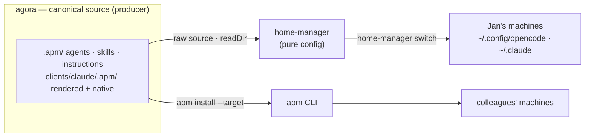
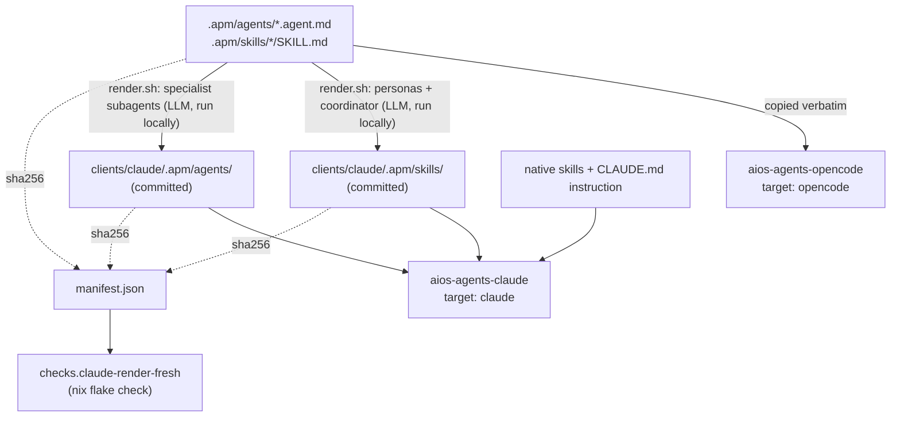
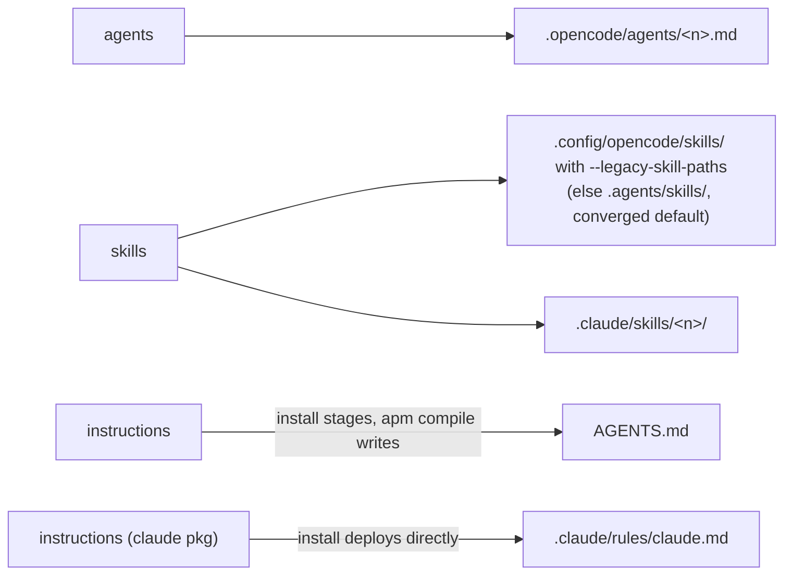

# Architecture

This document explains the *why* behind agora's structure — the parts that
aren't obvious just from reading `flake.nix` or the module edits in
`home-manager`.

## Two consumers, one source

Agora's `.apm/` primitives feed exactly two consumption paths, and they are
kept deliberately independent:

- **home-manager** reads agora's raw git tree via `readDir` (no build, no
  apm involved) and deploys to Jan's own machines.
- **apm** reads the same tree's `apm.yml` + `.apm/` layout and deploys to
  colleague machines via `apm install`.

Neither path is privileged over the other; both read the identical
committed source. This is what "one canonical source, never drift" means in
practice — not a promise enforced by process, but a structural consequence
of there being only one tree to read.

## Why OpenCode is verbatim and Claude is rendered (Path B)

[apm](https://github.com/microsoft/apm) is a deterministic, multi-target
compiler: author primitives once, `apm install --target <client>` deploys
them with no LLM involved. For most primitives and most targets that is
exactly right — but it breaks down for one specific case in this repo.

Agora's agents are authored **as OpenCode agents**: `model:` carries an
OpenCode/Copilot model identifier (e.g. `github-copilot/claude-opus-4.8`),
and permissions are expressed as OpenCode-native `permission:` blocks
(`edit:`, `write:`, `bash:` allowlists). apm's contract for the `agents`
primitive is to pass `model` through **verbatim** to every target, Claude
Code included. That is correct and sufficient for OpenCode, since OpenCode
*is* the source format. It is not sufficient for Claude Code: a
`github-copilot/...` model string means nothing to Claude Code, and apm has
no mapping from OpenCode's `permission:` shape to Claude's
`disallowed-tools` / `allowed-tools` frontmatter.

Rather than ship a broken verbatim deploy to Claude, agora keeps its
existing LLM-based renderer (`renderers/opencode-to-claude.md` +
`renderers/render.sh`) for exactly this transform:

- Model identifiers are mapped to Claude's short names (`opus`, `sonnet`).
- OpenCode `permission:` blocks are mapped to Claude's
  `disallowed-tools` / `allowed-tools` (skill outputs) or `tools:`
  allowlist (agent-file outputs) frontmatter.
- The renderer routes each source to one of two output shapes, not one:
  the 3 manual persona agents (`brainstorm`, `teach`, `build`) and the
  `coordinator` are re-authored as Claude **skills** (with
  `disable-model-invocation: true`, since they should only be invoked by
  name, never auto-triggered; `coordinator` renders under the name
  `workflow-explore`) — Claude has no bare "agent" primitive in the shape
  these need, since they are user-facing entry points, not Task-tool
  targets. The 3 specialist subagents (`explore`, `spar`, `plan`) are
  re-authored as real **Claude agent files** (`.claude/agents/<n>.md`)
  instead — they are OpenCode `mode: subagent`, invoked exclusively via the
  `task` tool by `coordinator`, and Claude's own Task tool addresses
  subagents by name the same way, so an agent-file deploy is the correct
  shape for them (verified empirically, see "Verification performed"
  below) rather than another skill-shaped workaround.

The render is not run inside `apm install` or `nix build`: it needs model
access and is non-deterministic, so **the output is committed** — the same
"Option A" decision this repo made before apm entered the picture. What
changed is only the *packaging* layer downstream of the render; the render
itself, and the reason for it, are unchanged.

**The drift guard.** `checks.claude-render-fresh` is a pure (no LLM, no
network) `nix flake check`: it recomputes the sha256 of every source file
(the 17 shared skills, the 3 manual persona agents `brainstorm teach build`,
the 3 specialist subagents `explore spar plan`, the `coordinator`, and the
renderer prompt itself) and compares against
`clients/claude/.apm/manifest.json`. If any source changed since the last
`render.sh` run, the check fails with `STALE: ...`. This is the safety net
that makes committing generated content safe: it is structurally impossible
to ship a Claude package that silently drifted from its OpenCode source,
because CI (and any local `nix flake check`) catches it first.

## Provenance metadata convention

Every cerebrum write from an agora agent carries structured provenance so
memories are filterable, supersedable, and client-agnostic. Only agents that
actually persist to cerebrum are in scope: the `coordinator` and the 3 manual
personas (`brainstorm`, `teach`, `build`). The 3 specialist subagents
(`explore`, `spar`, `plan`) are pure-return — they never call
`cerebrum_remember`/`cerebrum_memorize` themselves; persistence is the
calling agent's (`coordinator`'s) responsibility. The 4 dev subagents remain
out of scope.

| Agent | Default `type` | Recall style |
|-----------|--------------|--------------|
| `coordinator` | `plan` | AUTO (prefer_project) |
| `build` | `done` | AUTO (prefer_project) |
| `brainstorm` | `idea` | on-demand (prefer_project) |
| `teach` | `context` | on-demand (prefer_project) |

**Rules:**
- Pass the focus repo explicitly as the `project` arg on every
  `cerebrum_remember` call to override CEREBRUM_PROJECT in multi-repo
  sessions.
- `prefer_project` is passed on every `cerebrum_recall` call so results
  from the active repo rank higher without excluding global memories.
- `confidence` (`proposed`/`confirmed`/`verified`) is optional — set it
  when it adds signal; omit it otherwise.
- `status` defaults to `active` (server-injected); agents do not set it.
- Supersede = forget-and-replace: always note when a new write obsoletes a
  prior memory.
- `coordinator` stores the approved plan under scope `plan:<uuid>`
  (`type: plan`), promotes it with `cerebrum_memorize`, and upserts a
  per-repo plan-index entry — see its agent file for the full contract. It
  is the only agent that writes a `plan:` scope; `explore`/`spar`/`plan`
  never touch cerebrum writes at all.

## Primitive → target deployment map

What each `.apm/` primitive becomes, per client, once `apm install` runs:

Two things worth noting from this map:

- **Agents reach both targets.** apm supports a verbatim `.claude/agents/`
  deploy, and agora now uses it: `coordinator`, `brainstorm`, `teach`, and
  `build` stay OpenCode-only primary agents (`coordinator` renders to Claude
  as the skill `workflow-explore` instead — see below), but the 3 specialist
  subagents `explore`, `spar`, `plan` render to real `.claude/agents/<n>.md`
  files, verified empirically via a clean-export `apm install --target
  claude` (see "Verification performed" below). This used to be false —
  agora previously shipped persona content to Claude exclusively through the
  rendered skills path — but the coordinator architecture (explore/spar/plan
  as pure-return subagents addressed via Claude's own Task tool, same as
  OpenCode's) made agent-file parity the natural fit instead of another
  skill-shaped workaround.
- **Instructions are asymmetric between the two targets — verified
  empirically, not assumed.** OpenCode has no native per-file instruction
  reader: `apm install` only stages the content, and a separate
  `apm compile -g` writes the actual `AGENTS.md` (install prints
  a one-line hint to this effect). Claude Code is different: `apm install`
  deploys the instruction **directly** to `.claude/rules/claude.md`, and
  running `apm compile -t claude` afterward is a documented no-op for it
  ("Claude Code reads `.claude/rules/` directly, no further action
  needed" — apm's own compile output). Neither install nor compile ever
  produces a root-level `CLAUDE.md` file in this repo's setup; Claude Code
  doesn't need one. This asymmetry is a property of apm's per-target
  contract, not a choice agora makes — see apm's targets-matrix
  documentation for the general rule (opencode/codex/gemini need a
  post-install compile for instructions; claude/cursor/windsurf/kiro do
  not).

## apm conventions used in this repo

- **Naming:** package names use the `aios-` prefix
  (`aios-agents-opencode`, `aios-agents-claude`) even though the repo itself
  is themed (`agora`) — colleagues resolve by git ref
  (`vansweej/agora[/path]`), so the package `name:` field is free to carry
  the product-facing brand.
- **`targets:` is always pinned**, never left to auto-detect — this is a
  correctness guardrail as much as a convenience: an unqualified
  `apm install` against agora's root can only ever resolve to `opencode`.
- **`includes: auto`** is set explicitly on both `apm.yml` files (rather
  than left undeclared) so `apm audit` never raises an `includes-consent`
  advisory for content that is, in fact, meant to be published.
- **`$schema` is omitted** on both manifests, so they track apm's current
  working-draft contract (matching the installed CLI) rather than pinning
  to the more conservative, slower-moving OpenAPM v0.1 shape.

These same conventions are intended to extend to the other AI-OS component
repos (cerebrum, athenaeum, ai-coding) as they gain their own apm packages —
tracked separately from agora's own migration.

## Verification performed

The claims above were verified against a real `apm` CLI (v0.26.0), not
inferred from documentation alone:

- `apm compile --validate` inside this repo: 11 chatmodes + 2 instructions
  validated with zero errors — confirms agora's OpenCode-native
  `permission:` blocks (including the coordinator's `task:` allowlist and
  the specialist subagents' `mode: subagent`) never trigger apm's
  opencode-shape warnings.
- `apm install --target opencode` against a **clean git-archive export**
  (not the live working tree): zero warnings, zero security findings, 11
  agents + 16 skills deployed. Skills landed at `.agents/skills/` by
  default; `--legacy-skill-paths` correctly restored `.opencode/skills/`.
- `apm install --target claude` against the `clients/claude` subpath, same
  clean export: zero warnings, **3 agents deployed to `.claude/agents/`**
  (`explore.md`, `plan.md`, `spar.md` — spot-checked byte-for-byte against
  `render.sh`'s output), 21 skills + 1 rule deployed, `settings.json`
  **not in the write plan** (apm never touches it — confirmed), `.claude/rules/claude.md`
  exactly matches the source instruction body with frontmatter stripped by apm
  itself. Neither agora nor Home Manager owns a Claude Code settings file:
  Jan's user settings are corporate Bedrock configuration, while an enterprise
  managed-settings plist has higher precedence over permission rules. Prompt-free
  MCP access therefore requires an enterprise-managed allow policy; user-level
  rules cannot override it. See `docs/claude-setup.md` for the current-server
  request and the onboarding procedure for future servers.
- `apm compile -t claude` confirmed as a no-op for the instruction ("Claude
  Code reads `.claude/rules/` directly, no further action needed"), and
  `apm compile -g` confirmed as required (generates `AGENTS.md`
  from the staged instruction).
- **Gotcha found and worth remembering:** running these commands directly
  against agora's own live checkout (rather than a clean export) can trip
  apm's hidden-character security scan on gitignored build artifacts
  (`node_modules/` from unrelated tooling) that a real `apm install
  vansweej/agora` — which clones from git — would never see. Always
  validate against `git archive <ref> | tar -x` into a scratch directory,
  not the working tree.
